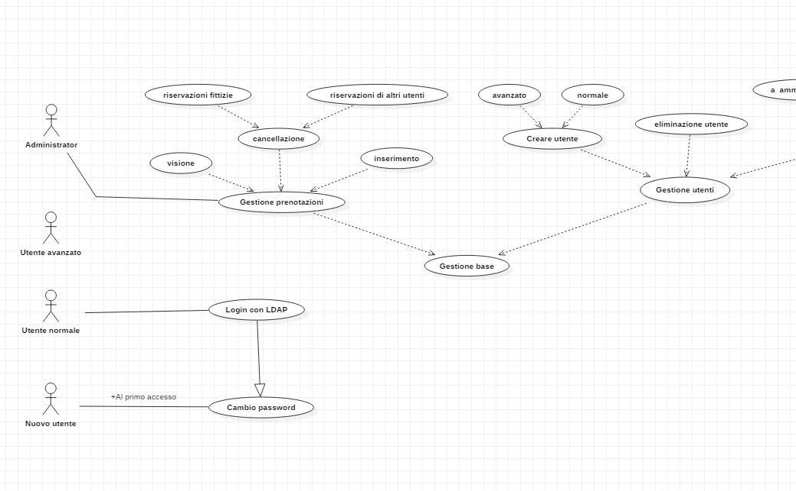

# PROGETTO CPT Meeting Room Scheduler | Diario di lavoro - 06.09.2019

##### Luca Di Bello

### Canobbio, 06.09.2019

## Lavori svolti

Durante le prime 2 ore di lezione ho terminato il diagramma di Gantt utilizzando il prodotto installato ieri.

Durante le due ore di lezione seguenti ho iniziato a stilare il diagramma Use Case con con l'aiuto di Paolo Gubeli, il quale mi ha consigliato un programma molto leggero e veloce: StarUML.
Per la creazione del mio diagramma ho utilizzato gli esempi fornitoci dal professor Valsangiacomo durante la lezione.

Come si puo' vedere dallo screenshot sovrastante il diagramma non e' stato terminato per mancanza di tempo.

Durante la lezione il mio supervisore mi ha esaminato con me i diari di lavoro delle lezioni scorse e mi ha spiegato come poter migliorare la qualità dei miei diari.
I prossimi diari non verranno piu' in Markdown ma verranno scritti utilizzanto il template scolastico con *Microsoft Word*.

## Problemi riscontrati e soluzioni adottate

Non ho riscontrato nessun problema.

## Punto della situazione rispetto alla pianificazione

Sono al passo con i tempi prestabiliti.

## Programma di massima per la prossima giornata di lavoro

Finire il capitolo relativo all'analisi.
